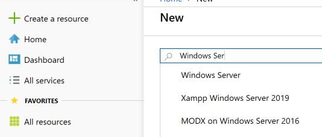

# Build the basic environment

First of all we need the network infrastructure in Azure. My suggestion for the solution would look like this:

Network|IP Range|Purpose
---|---|---
vNet|10.11.0.0/16|Overall network for the WDV deployment (Azure only)
Backend|10.11.2.0/24|Backend network to hold the DC
Clients|10.11.3.0/24|Client network to deploy the VMs of the host pool in

These vNet is quite big, to enable future testing and components in your environment. Feel free to change the IP ranges.

## How to deploy the Network

1. Go to the Azure Portal
2. Select __create a resource__  
   
3. In the Search bar look for __Virtual Network__  
   
4. In the dialog "New Virtual Network" click __create__  
   
5. Fill out the __parameters__ for the creation like in this sample (including a new resource group for the whole implementation)  
     
   _The subnet for the backend can be deployed in the same step._

After the vNet with the first subnet Backend is deployed we have to create the client subnet:

6. Go to the vNet deployed in step 5 and in the __settings section__ we can define a new subnet fot the clients  
   
7. After pressing the  the parameters for the new subnet must be provided  
   

To demo purpose no Network Security Group, Routing Table or other configuration where made. In a productive environment it is highly recommended to work with security features like this. for a deeper understanding please refer to the [Azure documentation](https://docs.microsoft.com/en-us/azure/virtual-network/security-overview).

## Deploy the Active Directory for our Demo

As mentioned before we need a Active Directory in the network where the client will be deployed. So we have to deploy a domain controller into our Backend Subnet in the next steps. To make as simple as possible this documentation deploys a domain controller based on a serve core image and a client to manage the domain in the Client Subnet. Feel free to deploy a full server or any other edition. 

8. Deploy the server core VM for the domain controller by clicking on the __Create a resource__ in the Azure portal   
   
9. Search for the Windows Server in the Marketplace and select __Windows Server__
    
10. Select the __Server Image__ you want to use - in this sample the Windows Server 2019 datacenter server core 
    
11. After clicking on __Create__ you get the dialog for a new VM in Azure  
    Here it is important to bring the VM in the Backend Subnet and expose the VM with an Public IP to the internet. Keep in mind that you have to open the RDP port for the connection and remember your local Admin password for the connection.
    At the end of the dialog you get the summary - it should somehow like this one:  
      
12. Next Step in the deployment is the installation of the __Active Directory__ on the new VM.  
    To achieve this, connect to the VM via RDP an than open an PowerShell on the command prompt:  
    
13. To deploy the Windows Feature for domain services use the following PowerShell command:  

    ```ps
    Install-WindowsFeature AD-Domain-Services -IncludeManagementTools
    ```

14. And as a second step in the PowerShell deploy the new forest  

    ```ps
    Install-ADDSForest -DomainName DomainName -SafeModeAdministratorPassword (Convertto-SecureString -AsPlainText "Passwort" -Force)
    ```

    Please paste in your domain name and the admin password at the parameter _DomainName_ und _"Password"_ in the powershell statement

15. Reboot the new deployed DC and your domain should be up and running

## Deploy a VM as client to manage your domain 

To manage the Active Directory and to ensure that everything works in the environment, a client VM is deployed into the Client Subnet. The management client is going to be joined to the Active Directory (see step 14) and the RSAT Tools are installed.

16. Deploy a VM - depending on the subscription being uses, different kind of images are available. In this demo a Windows 10 Image was used to deploy the management client  
    
17.  After the client is deployed it could be interesting to check the dns name resolution in your network. First step - check whether the domain controller is able to resolve DNS request. Connect via RDP to your DC and check with e.g. __nslookup__ the external DNS resolution  
      
18. Get the Azure DNS Server IP to configure the vNet for DNS - the fastest way if you not already know the IP is to connect to client and get the ipconfig __ipconfig /all__ an check the provided DNS information
      
    in this Case we have the __168.63.129.16__
19. Change the DNS setting for the vNet in the Azure portal  
      
20. Before the management client can be joined to the domain, the DNS config of the VM must be refreshed and than the VM can be joined to the AD created on the domain controller in step 14  
      
    Enter the needed Domain Admin credentials and than reboot the VM  
21. Check at the end that the management VM is now in the domain and install the RSAT Tools from the following URL  
    https://www.microsoft.com/en-us/download/details.aspx?id=45520  
22. In preparation for the further deployment of the Windows Virtual Desktop Service it would be helpful to already have a special OU in the AD for the clients in the host pool. In this sample an OU __WVDDemo__ is deploy with __Clients__ and __User__ as folders. 
    

[Back to the main page](https://github.com/CSA-OCP-GER/windows-virtual-desktop/)
