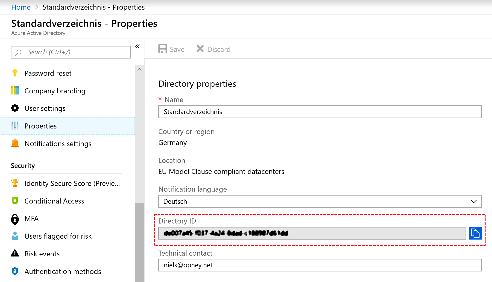
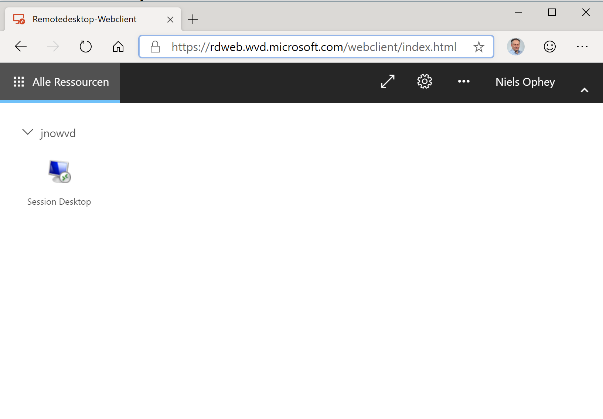
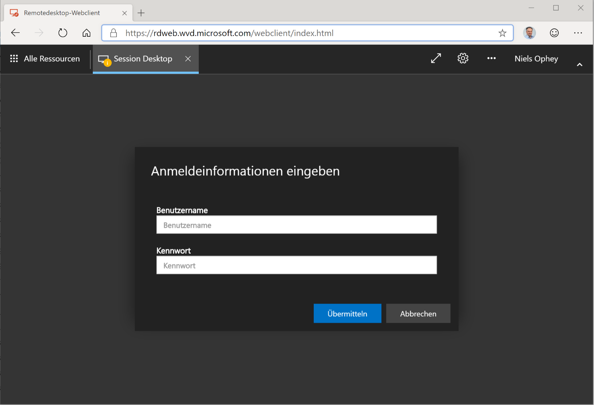
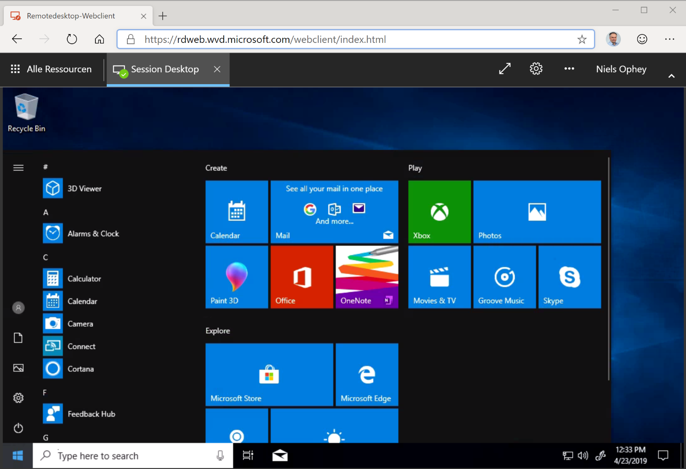

# Build the Windows Virtual Desktop (WVD) infrastructure

To integration WVD in the own Azure infrastructure there a some steps to do:

    - Create a tenant in Windows Virtual Desktop
    - Create a host pool with Azure Marketplace
    - Manage app groups for Windows Virtual Desktop Preview


All these steps are descripted in the Microsoft Docs - so please follow the steps in the Docs.

## Create a tenant in Windows Virtual Desktop

[Step by step guide Microsoft Docs](https://docs.microsoft.com/de-de/azure/virtual-desktop/tenant-setup-azure-active-directory)

Important to know - you will need the Directory ID of the Azure AD to which the WVD Service should be registered. You will find the ID in the Azure Portal (see screenshot):




With the Directory ID in "mind" better in the clipboard, it is possible to register the server and client app for the Virtual Desktop Service under https://rdweb.wvd.microsoft.com/.

The next Step in the Doc is to assign special rights to the AAD User who will be the WVD AAD Admin. The WVD Admin do not need to have Enterprise Admin rights. 

## Create a host pool with Azure Marketplace

Before deploying the first host pool to the infrastructure there is one important fact to consider. As long as no directory synchronization is in place between the on prem AD (even if it is deploy in Azure) and the AAD, the only way to deploy the Host pool is to use a service principal for deployment (see https://docs.microsoft.com/de-de/azure/virtual-desktop/create-service-principal-role-PowerShell).

***How to create a service principal***

Open a PowerShell command and install the AzureAD Module. Afterward declare some variables

```PowerShell
$myTenantGroupName = "<my-tenant-group-name>"

$myTenantName = "<my-tenant-name>"
```

Next Step will be to create the service principal

```PowerShell
Import-Module AzureAD

$aadContext = Connect-AzureAD

$svcPrincipal = New-AzureADApplication -AvailableToOtherTenants $true -DisplayName "Windows Virtual Desktop Svc Principal"

$svcPrincipalCreds = New-AzureADApplicationPasswordCredential -ObjectId $svcPrincipal.ObjectId
```

At the end you can get all the values you need during the deployment of the host pool by executing the following PowerShell command:

 ```PowerShell
## Login with the service principal
$creds = New-Object System.Management.Automation.PSCredential($svcPrincipal.AppId, (ConvertTo-SecureString $svcPrincipalCreds.Value -AsPlainText -Force))

Add-RdsAccount -DeploymentUrl "https://rdbroker.wvd.microsoft.com" -Credential $creds -ServicePrincipal -AadTenantId $aadContext.TenantId.Guid

## Show all IDs for the host pool
$svcPrincipalCreds.Value

 $aadContext.TenantId.Guid

 $svcPrincipal.AppId
```

All other steps can be done as described in the Microsoft Docs, except the deployment credentials. In the step [Windows Virtual Desktop Preview tenant information](https://docs.microsoft.com/de-de/azure/virtual-desktop/create-host-pools-azure-marketplace#windows-virtual-desktop-preview-tenant-information) use the service principal instead of user credentials.

## Test the access to the session hosts

As far as this sample is based on having no synchronization between Azure AD and "hostpool AD" - you should use the Web portal of the WVD service to access the RDP session. The URL is at the moment:

https://rdweb.wvd.microsoft.com/webclient/index.html

After login with Azure AD credentials of a user having the right permissions assigned: 



After starting the connection and select the options (printer, clipboard) you will be prompted for the credentials:



Starting the Session Desktop the user will be connected to the session host via the browser:



Please note that in the current status of the preview version only the way over the web session allows to change the username during the log in on the session host.


[Back to the main page](https://github.com/CSA-OCP-GER/windows-virtual-desktop/)
