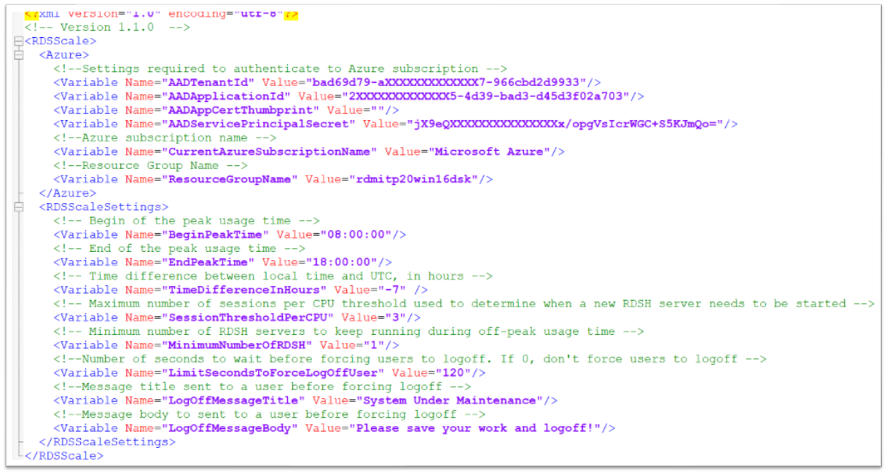

# Collection of topics out of our workshops

## 1. How does Scaling work for the WVD host pool?

see https://docs.microsoft.com/de-de/azure/virtual-desktop/set-up-scaling-script 

_Example for a xml config file_

To save on cost some customers will want to spin down resources during off hours. Today the way to do that is with a schedule task. Runs as a scheduled task on a Windows VM in the subscription. Then you can also schedule a task to spin up resources before users log in for the day, thus saving many hours of Azure utilization.

You’ll see the above sample script does more of a soft drain mode, allowing user sessions to close out and take away Hosts when empty.