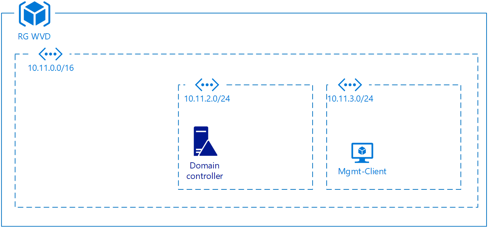

# Windows Virtual Desktop (Preview Version)

Oneday workshop to have a first view on the service and hands on with the public preview of Windows Virtual Desktop.

## Basic Links

Inhalt|URL
----|-----|
Prductpage|https://azure.microsoft.com/de-de/services/virtual-desktop/
Docs|https://docs.microsoft.com/de-de/azure/virtual-desktop/overview

## Inhalt

The workshop has three main part
1. Introduction to the service
2. Build the basic enviroment
3. Build the Windows Virtual Desktop (WVD) infrastructure

## Introduction
Please click thru the provided slides...

## Build the basic enviroment
If you want to build an WVD szenario, you need to have a Active Directory (AD) and an Azure AD Tenant to deploy the WVD app in. So the first step is to deploy a AD with all needed infrastructure components needed in a Azure resource group.

The following picture shoes what we need:  

---
**Exercise 1:**

---

Deploy the basic infarstructur to an azure ressource gr and provice the following information

Key|Value
----|----
domianname|
adminuser|
password|
subnet|

---

[Step by step](2_basic_infrastructure/readme.md)

---

After the basic infrastructrue is setup, we can start to build the WVD integration into an existing Azure AD

## Windows Virtual Desktop infrastructure

Now we need to make the steps to bring the WVD Service into the Subscription. The intial first Step is to register the WVD App as an enterprise app on the AAD.

So after checking that all prerequisites have been met, you can move on to the initial setup of Windows Virtual Desktop. Once these steps have been completed, you will be ready to deploy your initial VMs:

- Allow the Windows Virtual Desktop service to access Azure AD.
- Assign the “TenantCreator” role to a user account.
- Create a Windows Virtual Desktop tenant.
- Deploy your first Windows Virtual Desktop host pool.
- Test if a user can access a full desktop session.

---
**Exercise 2:**

---

Deploy the needed components to have a first Host Pool in the client subnet and provision at least one user to have access to the WVD infrasturcture  

---

[Step by step](3_wvd_infrastructure/readme.md)

---

